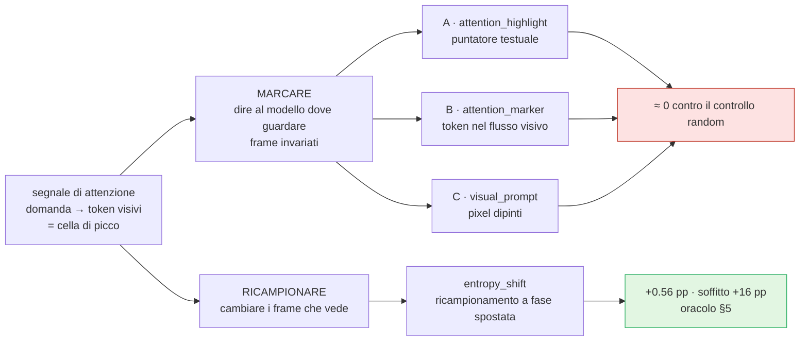
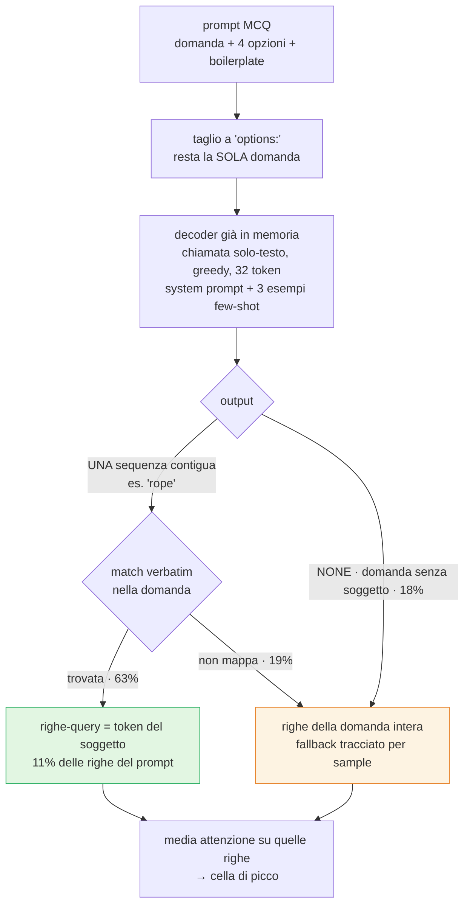
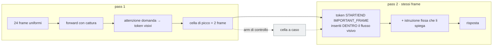
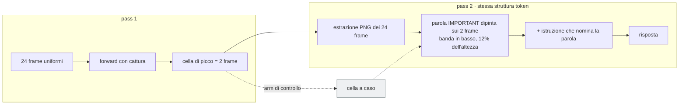
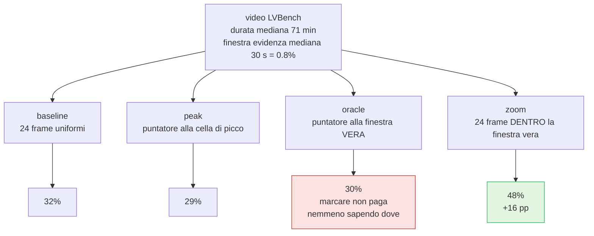
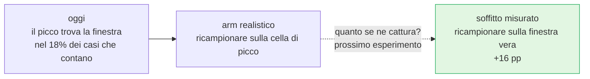

# Risultati — Qwen3-VL su Video-MME e LVBench

Solo tabelle e schemi. Letture, caveat e ragionamenti in
[`260901-comments.md`](260901-comments.md). Continua
`260803-tabelle_risultati.md` (stesso filone su Qwen2.5-VL-3B, invariato).

**Setup.** `qwen3_vl_2b_attn`, greedy (`generation=precise`), `seed=42`,
`nframes=24`, Video-MME intero senza sottotitoli, 3 shard da 900 — accuracy
**pooled** (Σ corretti / Σ campioni). Run wandb:
[`video_mme-qwen3vl2b`](https://wandb.ai/alesvale97-unimore/video_mme/groups/video_mme-qwen3vl2b)
(baseline, job 92353),
[`video_mme-qwen3vl2b-ablation`](https://wandb.ai/alesvale97-unimore/video_mme/groups/video_mme-qwen3vl2b-ablation)
(arm: 92377 `entropy_shift`, 92844/92845 `marker`, 94528/94532
`visual_prompt`),
[`video_mme-qwen3vl4b`](https://wandb.ai/alesvale97-unimore/video_mme/groups/video_mme-qwen3vl4b)
(baseline 4B, job 93328).

---

## 1. Il quadro: due modi di usare il segnale

---

## 2. Arm su Qwen3-VL-2B (2700 sample)

`query_rows`/`sink_filter` = su quale segnale l'arm classifica le celle.
Fra parentesi il Δ contro la baseline della stessa fascia.
**SE della differenza: ±1.36 pp sul pooled, ±2.35 pp per fascia.**

| arm | `query_rows` | `sink_filter` | pooled | Δ | short | medium | long |
|---|---|---|---:|---:|---:|---:|---:|
| `baseline_24` | — | — | **54.44%** (1470/2700) | — | 66.89% | 52.33% | 44.11% |
| `entropy_shift_24` | `all` | `true` | **55.00%** (1485/2700) | **+0.56** | 67.78% (+0.89) | 52.11% (−0.22) | 45.11% (+1.00) |
| `marker_24` (attention) | `question` | `false` | **53.04%** (1432/2700) | −1.41 | 66.33% (−0.56) | 49.56% (−2.78) | 43.22% (−0.89) |
| `marker_random_24` (random) | `question` | `false` | **53.11%** (1434/2700) | −1.33 | 66.44% (−0.44) | 49.89% (−2.44) | 43.00% (−1.11) |
| `visual_prompt_24` (attention) | `entity` | `true` | **53.48%** (1444/2700) | −0.96 | 65.89% (−1.00) | 51.44% (−0.89) | 43.11% (−1.00) |
| `visual_prompt_24_random` (random) | `entity` | `true` | **53.52%** (1445/2700) | −0.92 | 66.22% (−0.67) | 50.78% (−1.56) | 43.56% (−0.56) |

**Il confronto che conta è interno** — treatment contro il proprio controllo,
a parità di ogni knob:

| coppia | Δ | in sample |
|---|---:|---:|
| `marker_24` − `marker_random_24` | −0.07 pp | **−2 / 2700** |
| `visual_prompt_24` − `visual_prompt_24_random` | −0.04 pp | **−1 / 2700** |

Gate d'entropia (solo `entropy_shift_24`; gli altri arm girano con
`always_highlight=true`, nessun gate): % resampling **53.70%** (1450/2700),
acc | high ans entropy 37.86%, acc | low ans entropy 74.88%.

### 2.1 Dove vanno le risposte — `visual_prompt` (2700)

| | rotti | recuperati | netto |
|---|---:|---:|---:|
| `visual_prompt_24` (attention) | 156 / 1476 (10.6%) | 123 / 1223 (10.1%) | −33 |
| `visual_prompt_24_random` | 151 / 1477 (10.2%) | 119 / 1223 (9.7%) | −32 |

---

## 3. I tre meccanismi

### 3.1 Selezione delle righe-query: `query_rows=entity`

Quali righe della domanda entrano nella media dell'attenzione.

| `query_rows` | righe mediate |
|---|---|
| `all` (regime storico) | 100% del prompt |
| `question` | ~24% |
| `entity` (v4) | **~11%** |

Percentuali di esito misurate sul fullset (shard 0, 900 sample). Tre
iterazioni del prompt di estrazione: v1 → 8/60 utili; v3 → 60/60 mappate ma
prolisse; **v4** → 40/50 utili sui non-NONE (`260901-comments.md` §6.2).

### 3.2 `attention_marker` — segnale consegnato come token

### 3.3 `visual_prompt` — stesso segnale consegnato come pixel

Nessuno split del blocco video, dimensione dei frame invariata: **struttura
dei token identica alla baseline**, cambia solo il contenuto dei pixel.

| | `marker_*` | `visual_prompt_*` |
|---|---|---|
| canale | token inline | pixel dipinti |
| `query_rows` | `question` | `entity` |
| `sink_filter` | `false` | `true` |
| `top_k` / `always_highlight` | 1 / `true` | 1 / `true` |
| geometria overlay | — | `bottom`, `height_frac=0.12` |
| costo vs baseline | 3.2× | 3.5× |

---

## 4. Scala del modello: 2B contro 4B (baseline, 2700)

| | Qwen3-VL-2B | Qwen3-VL-4B | Δ |
|---|---:|---:|---:|
| pooled | 54.44% (1470/2700) | **58.85%** (1589/2700) | **+4.41** |
| short | 66.89% | **69.00%** | +2.11 |
| medium | 52.33% | **56.78%** | +4.44 |
| long | 44.11% | **50.78%** | **+6.67** |
| latenza (shard L40S) | 3.32 s | 3.54 s | +6.6% |

z = 3.27 (p ≈ 0.0011) — **l'unico Δ del filone fuori dal rumore**.

| intervento | Δ accuracy | costo |
|---|---:|---:|
| `entropy_shift_24` (2B) | +0.56 pp | 2.70× |
| `marker_*` (2B) | −1.4 pp | 3.2× |
| `visual_prompt_*` (2B) | −0.9 pp | 3.5× |
| **passare al 4B** | **+4.41 pp** | **1.07×** |

### 4.1 Stesso arm sui due modelli (`entropy_shift_24`)

| | Qwen2.5-VL-3B | Qwen3-VL-2B |
|---|---:|---:|
| `baseline_24` | 55.04% | 54.44% |
| `entropy_shift_24` | 55.63% | 55.00% |
| **Δ arm − baseline** | **+0.59** | **+0.56** |
| % resampling | 73.15% | **53.70%** |
| costo arm / baseline | 1.69× | **2.70×** |
| sovraccosto per sample ricampionato | 3.54 s | **10.5 s** |

### 4.2 Breakdown per task type (`entropy_shift_24`)

In grassetto ogni arm sopra la **propria** baseline. Cinque categorie stanno
sotto i 180 sample, dove 2 pp è un sample solo: conta il segno.

| task type | n | 2.5-3B base | 2.5-3B arm | Δ | 3-2B base | 3-2B arm | Δ |
|---|---:|---:|---:|---:|---:|---:|---:|
| action reasoning | 285 | 52.98 | **53.33** | +0.35 | 44.21 | **46.32** | +2.11 |
| action recognition | 313 | 51.76 | 51.12 | −0.64 | 53.04 | **54.31** | +1.28 |
| attribute perception | 222 | 65.32 | **69.37** | +4.05 | 66.22 | **67.57** | +1.35 |
| counting problem | 268 | 33.58 | **37.69** | +4.10 | 38.43 | 37.31 | −1.12 |
| information synopsis | 323 | 71.21 | 68.73 | −2.48 | 73.07 | 71.83 | −1.24 |
| object reasoning | 454 | 53.96 | **55.73** | +1.76 | 49.34 | **50.00** | +0.66 |
| object recognition | 354 | 57.91 | **59.04** | +1.13 | 61.58 | **62.43** | +0.85 |
| ocr problems | 139 | 59.71 | 58.27 | −1.44 | 58.27 | **62.59** | **+4.32** |
| spatial perception | 54 | 61.11 | **62.96** | +1.85 | 62.96 | 61.11 | −1.85 |
| spatial reasoning | 56 | 67.86 | **71.43** | +3.57 | 66.07 | 64.29 | −1.79 |
| temporal perception | 55 | 63.64 | 56.36 | −7.27 | 61.82 | 54.55 | **−7.27** |
| temporal reasoning | 177 | 38.98 | 36.72 | −2.26 | 36.16 | **37.85** | +1.69 |
| **↑ / ↓ vs baseline** | | | | **7 / 5** | | | **7 / 5** |

---

## 5. Oracolo su LVBench: marcare o ricampionare?

Benchmark con la **finestra d'evidenza annotata**: si punta / si ricampiona
sul posto giusto per costruzione, e si misura il soffitto. 100 sample,
`qwen3_vl_2b_attn`, 24 frame (job 94348; dettagli in
[`oracolo_lvbench.md`](oracolo_lvbench.md)).

| condizione | accuracy | Δ | appaiato | p (McNemar) |
|---|---:|---:|---:|---:|
| `baseline` — 24 frame uniformi | 32% | — | — | — |
| `peak` — puntatore alla cella di picco | 29% | −3 | +4/−7 | 0.55 |
| `oracle` — puntatore alla finestra **vera** | 30% | −2 | +5/−7 | 0.77 |
| **`zoom`** — 24 frame **dentro** la finestra vera | **48%** | **+16** | **+22/−6** | **0.0037** |

`zoom` contro `oracle` — stessa informazione, due modi di consegnarla:
**+23/−5, p = 0.0009**.

### 5.1 Perché: l'evidenza non è nei frame campionati

| | n | baseline | zoom |
|---|---:|---:|---:|
| finestra con **< 1** frame atteso nel campione uniforme | 77 | 27% | **49%** |
| finestra con **≥ 1** frame atteso | 23 | 48% | 43% |

Tutti e 22 i sample recuperati da `zoom` stanno nel primo gruppo.

### 5.2 Il segnale d'attenzione, misurato senza passare dall'accuracy

Hit = la cella di picco interseca la finestra annotata (job 93613, 60 sample).

| rowset | hit | livello di caso |
|---|---:|---:|
| `all` | 28.3% | 15.8% |
| `question` | 28.3% | 15.8% |
| `entity` | 30.0% | 15.8% |

Confermato su 100 sample: 31% contro 18.8% atteso, **z = 4.21**. Il segnale
esiste (~2× il caso) ma **sui 22 sample in cui `zoom` recupera la risposta il
picco cade nella finestra solo 4 volte (18%)**.

---

## 6. Sintesi

| direzione | stato | evidenza |
|---|---|---|
| **marcare** (A / B / C) | **chiuso** | 3 canali, 3 controlli random, tutti a ≈0; oracolo 30% contro baseline 32% |
| affilare il segnale (`query_rows`, `sink_filter`) | **esaurito** | grezzo e raffinato pareggiano entrambi il controllo; hit-rate invariato fra rowset |
| **ricampionare** | **aperto** | unico arm sopra baseline (+0.56 pp); soffitto **+16 pp** |
| localizzare la finestra | **collo di bottiglia** | il picco la trova nel 18% dei casi in cui il guadagno vive |
| scala del modello | **riferimento** | +4.41 pp per +6.6% di costo |

