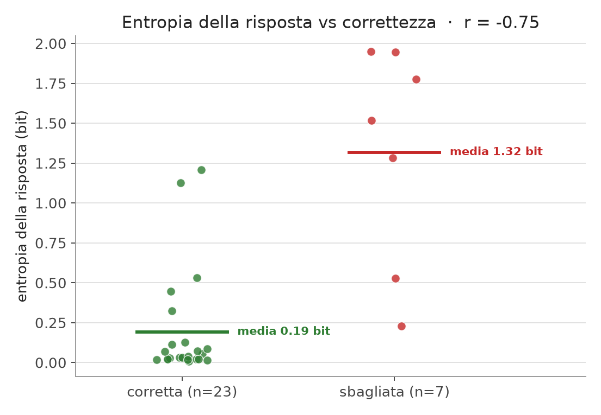
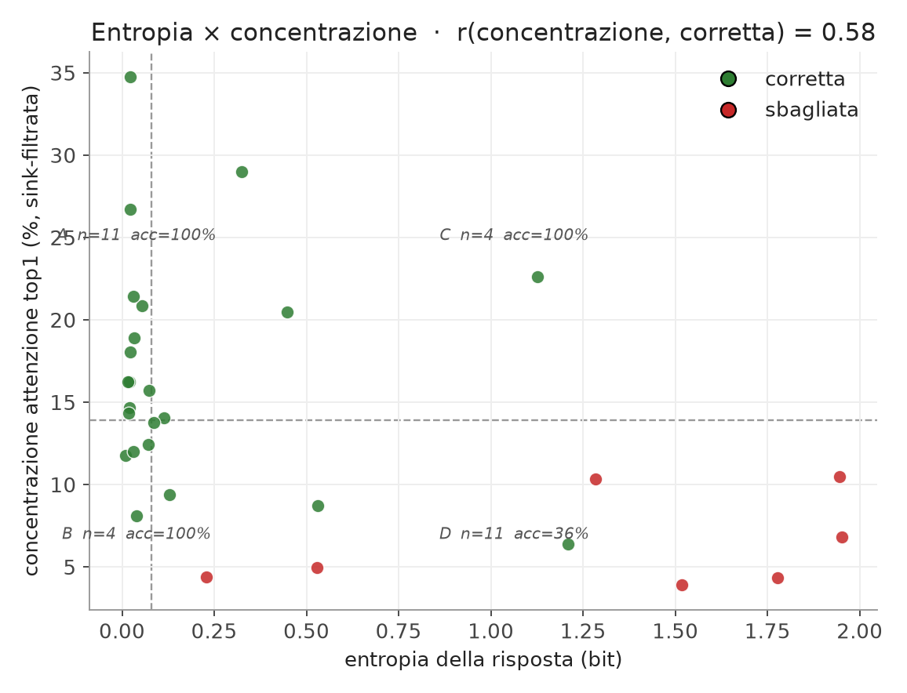
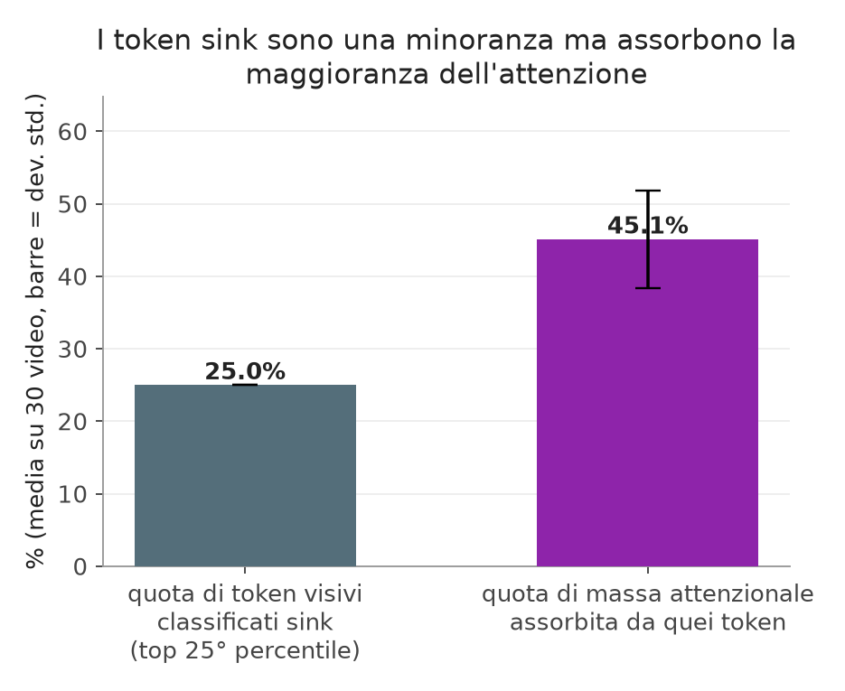
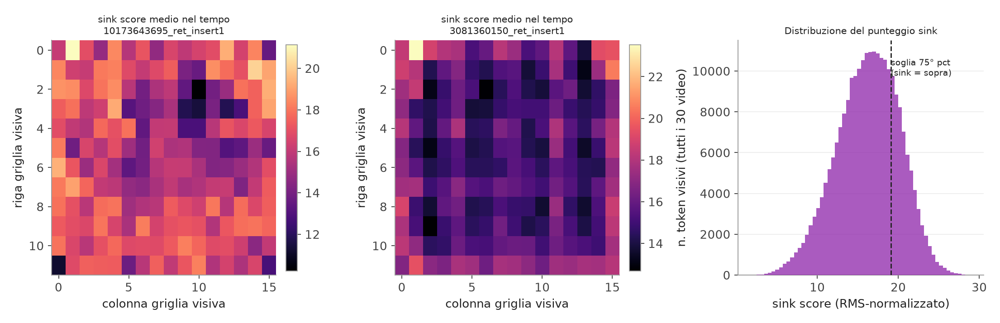

# Entropia, concentrazione dell'attenzione e sink — analisi su VNBench "retrieval"

> Report statico (numeri + grafici) generato dai dati già catturati in
> `data/vnbench/output_v4/` (30 capture `.pt`), replicando esattamente i
> calcoli della pagina interattiva `/analisi` di `attn_explorer.serve`
> (stessi default: nessuna selezione di token → media su tutta la domanda,
> `sink_percentile=25`, `sink_border=0`) e aggiungendo una sezione dedicata a
> verificare la presenza dei **sink** così come li definiamo in questo
> progetto. Nessun nuovo forward del modello: solo lettura dei `.pt`
> esistenti + i sidecar `.json` in `data/vnbench/videos/v4/` per la risposta
> corretta (`gt_option`).
>
> Script di generazione: vedi in fondo al documento (§7). Figure in
> `docs/assets/entropia_sink_analisi/`.

## 1. Dataset e setup

- **Benchmark**: VNBench, categoria "retrieval" (3 sotto-tipi: `ret_insert1`,
  `ret_insert2`, `ret_edit1` — un elemento/needle inserito o modificato nel
  video, la domanda MCQ chiede di identificarlo).
- **Modello**: `Qwen/Qwen2.5-VL-3B-Instruct`, prefill-only (nessuna
  generazione), 48 frame campionati uniformemente con frame-doubling
  (`double_frames=True` → ogni cella temporale = 1 frame reale), griglia
  visiva `12×16` per cella (`max_pixels=151200`).
- **N = 30 video**, store `data/vnbench/output_v4/`.
- **Breakdown per sotto-tipo** (corrette / sbagliate):

  | sotto-tipo | n | corrette | sbagliate |
  |---|---|---|---|
  | ret_insert1 | 11 | 8 | 3 |
  | ret_insert2 | 10 | 7 | 3 |
  | ret_edit1 | 9 | 8 | 1 |
  | **totale** | **30** | **23** | **7** |

## 2. Entropia della risposta vs correttezza

Per ogni sample MCQ, il forward di prefill produce comunque i logit
sull'ultimo token del prompt (`logits_to_keep=1`). Si estrae la softmax
**ristretta alle sole lettere candidate** (A/B/C/D) → `answer_probs`, e da lì
l'entropia in bit: 0 = certezza assoluta, `log2(n_opzioni)` (2 bit per 4
opzioni) = distribuzione uniforme, il modello "tira a indovinare". Nessun
costo di calcolo aggiuntivo: sono gli stessi logit del prefill.

| gruppo | n | entropia media (bit) | mediana | dev. std. |
|---|---|---|---|---|
| risposte corrette | 23 | 0.193 | 0.039 | 0.330 |
| risposte sbagliate | 7 | 1.319 | 1.519 | 0.639 |

- **Correlazione di Pearson r(entropia, corretta) = −0.75.**
- Le risposte sbagliate hanno entropia media **~6.8×** quella delle
  risposte corrette.
- Le 7 risposte sbagliate sono concentrate nella metà alta della
  distribuzione di entropia, con un'eccezione (`v_7OcxT66BxX0_ret_insert1`,
  0.23 bit — confidenza medio-bassa ma risposta comunque sbagliata: pred B,
  gt D).

## 3. Concentrazione dell'attenzione (sink-filtrata) vs correttezza

`attention_concentration` (in `utils/attn_core.py`) aggrega l'attenzione su
tutta la domanda, **azzera le celle classificate sink** (vedi §4 — senza
questo filtro il segnale è quasi piatto, dominato dai token sink che
assorbono massa indipendentemente dal contenuto) e misura `top1_pct`: la
percentuale di attenzione (residua, non-sink) che cade sulla singola cella
temporale più attenzionata. Alto ⇒ il modello "si fissa" su un frame
(grounding); basso ⇒ attenzione dispersa, nessun frame spicca.

- **Correlazione di Pearson r(top1_pct, corretta) = 0.58.**
- Quadranti (soglie = mediana del campione: entropia 0.079 bit,
  concentrazione 13.9%):

  | quadrante | n | accuratezza |
  |---|---|---|
  | A · sicuro e concentrato | 11 | 100% |
  | B · sicuro ma disperso | 4 | 100% |
  | C · incerto ma concentrato | 4 | 100% |
  | D · incerto e disperso | 11 | 36% |

  Gli errori si concentrano quasi tutti nel quadrante D ("incerto e
  disperso": 10 dei 14 casi con entropia sopra mediana ricadono qui, e lì
  l'accuratezza crolla al 36%). Bassa entropia *o* alta concentrazione
  bastano singolarmente per un'accuratezza perfetta nel campione; la
  combinazione "incerto e disperso" è dove si concentra la massa degli
  errori.

## 4. Sink: sono presenti, come li definiamo

### 4.1 Definizione operativa usata in questo progetto

Un **token visivo-sink** non è definito dalla posizione nel frame, ma da una
proprietà interna allo stato nascosto del modello (metodo "sink-dims",
Xiao et al., già usato in `lot/retrieval.py`):

1. Per il modello corrente (`Qwen/Qwen2.5-VL-3B-Instruct`) esiste una
   tabella **fissa e hardcoded** di canali "sink" nello hidden state:
   `SINK_DIMS = (318, 1874, 1819)` (`models/qwen_attn.py`). Questi 3 canali
   sono una costante per-modello, ricalcolata offline, **non** dedotta dal
   contenuto del singolo video — motivo per cui sono identici sui 30 capture
   qui analizzati.
2. Ad ogni layer decoder, per ogni token visivo, si calcola
   `score = max(|hidden[sink_dims]|) / RMS(hidden)` — il picco sui 3 canali
   sink normalizzato per l'ampiezza RMS del vettore hidden completo del
   token (questa parte **è** calcolata dal vero forward su quel video,
   quindi varia per token/video/layer).
3. Si media sui layer "centrali" (metà layer del decoder) → `sink_map`
   `[t, grid_h, grid_w]`, un punteggio per ogni token visivo.
4. A runtime (server o script), un token è classificato **sink** se il suo
   `sink_score` è nel **top-25° percentile** della distribuzione di
   `sink_map` (`sink_mask`, `percentile=25`, stesso default della UI).

Quindi: *quali* canali guardare è fisso per costruzione; *quanto* un token
specifico li attiva (e se supera la soglia percentile) è un dato empirico
per ogni video.

### 4.2 Evidenza quantitativa: pochi token assorbono la maggioranza dell'attenzione

Se i punteggi sink fossero irrilevanti per l'attenzione, il 25% di token più
"sink" dovrebbe ricevere ~25% della massa attenzionale grezza (proporzionale
al loro numero). Non è così:

| quantità | media sui 30 video | dev. std. | min | max |
|---|---|---|---|---|
| quota di token classificati sink (25° pct, per costruzione) | 25.0% | 0.02pp | — | — |
| **quota di massa attenzionale assorbita da quei token** | **45.1%** | 6.7pp | 32.0% | 63.8% |

Il 25% di token "sink" assorbe in media **1.8×** la massa che gli spetterebbe
se l'attenzione fosse distribuita uniformemente — e questo vale **in tutti
e 30 i video del campione senza eccezioni** (il minimo osservato, 32.0%, è
comunque sopra il 25% di riferimento). Questa è la ragione per cui
`attention_concentration` (§3) filtra via i sink prima di misurare su quale
*frame* si concentra il modello: senza il filtro, la métrica sarebbe dominata
da "quanti token sink capitano in quella cella", non dal contenuto.

### 4.3 Distribuzione dei punteggi ed esempio spaziale

- Le due heatmap a sinistra mostrano `sink_map` mediata sul tempo (48 celle)
  per due video di esempio: il punteggio **non è uniforme sulla griglia
  spaziale 12×16** — alcune posizioni sono sistematicamente più "sink" di
  altre entro lo stesso video, altre restano basse.
- **Non** abbiamo però trovato un bias sistematico di bordo/angolo valido
  su tutto il campione: la cella di picco (media sul tempo) cade in un
  angolo esatto della griglia in **0/30** video, e la quota di punteggio
  sink catturata dall'anello di bordo della griglia (31.6%) è solo
  leggermente sopra la quota di celle che quell'anello rappresenta (27.1%)
  — un'euristica "sink = bordo" (l'opzione `sink_border` disponibile nel
  server, di default OFF) **non è supportata** da questo campione e va
  trattata come non verificata, come già segnalato nel docstring di
  `sink_mask`.
- L'istogramma (destra, punteggi di tutti i 30×48×12×16 token visivi)
  mostra una distribuzione con coda a destra: la soglia al 75° percentile
  (equivalente al 25° percentile "top" usato da `sink_mask`) isola una
  minoranza di token con punteggio marcatamente più alto della massa
  centrale — coerente con la definizione di "sink" come outlier di
  attivazione, non con un secondo modo ben separato.

## 5. Dettaglio per video

Ordinato per entropia decrescente. `top1_pct` = concentrazione sink-filtrata
(§3); `sink_mass%` = quota di massa attenzionale grezza sui token sink (§4.2).

| video | esito | entropia (bit) | top1_pct | quadrante | pred | gt | sink_mass% |
|---|---|---|---|---|---|---|---|
| 3081360150_ret_insert1 | sbagliata | 1.9511 | 6.8 | D | B | C | 49.7 |
| v_zTHkqpNFGno_ret_insert2 | sbagliata | 1.9453 | 10.5 | D | A | C | 43.2 |
| v_4uKoAk5NCkI_ret_edit1 | sbagliata | 1.7764 | 4.3 | D | D | A | 42.5 |
| 13199465314_ret_insert2 | sbagliata | 1.5186 | 3.9 | D | A | B | 50.6 |
| 8283116453_ret_insert2 | sbagliata | 1.2833 | 10.3 | D | B | C | 48.8 |
| 3261112327_ret_insert2 | corretta | 1.2083 | 6.4 | D | D | D | 45.8 |
| 6236724261_ret_insert2 | corretta | 1.1255 | 22.6 | C | A | A | 32.4 |
| video7694_ret_insert2 | corretta | 0.5305 | 8.7 | D | C | C | 42.2 |
| 3501167063_ret_insert1 | sbagliata | 0.5292 | 5.0 | D | D | A | 35.6 |
| v_-YwrMtiqHKg_ret_insert2 | corretta | 0.4484 | 20.5 | C | B | B | 43.2 |
| 8069728449_ret_insert2 | corretta | 0.3243 | 29.0 | C | D | D | 43.2 |
| v_7OcxT66BxX0_ret_insert1 | sbagliata | 0.2286 | 4.4 | D | B | D | 42.8 |
| video7429_ret_edit1 | corretta | 0.1290 | 9.4 | D | A | A | 49.5 |
| 3122394310_ret_insert2 | corretta | 0.1146 | 14.1 | C | A | A | 32.8 |
| video7653_ret_insert1 | corretta | 0.0855 | 13.7 | D | D | D | 47.1 |
| 5650793185_ret_insert2 | corretta | 0.0724 | 15.7 | A | B | B | 32.0 |
| video9738_ret_edit1 | corretta | 0.0711 | 12.4 | B | C | C | 52.4 |
| 13125896183_ret_edit1 | corretta | 0.0544 | 20.8 | A | A | A | 46.8 |
| video7736_ret_insert2 | corretta | 0.0386 | 8.1 | B | C | C | 63.8 |
| v_nciIPwJTok8_ret_edit1 | corretta | 0.0329 | 18.9 | A | C | C | 49.0 |
| v_HWFosaUWoSI_ret_insert1 | corretta | 0.0314 | 21.4 | A | A | A | 48.0 |
| v_32vYs9wKXE8_ret_edit1 | corretta | 0.0302 | 12.0 | B | A | A | 41.9 |
| 2430157408_ret_edit1 | corretta | 0.0233 | 26.7 | A | A | A | 43.1 |
| 2667165452_ret_insert1 | corretta | 0.0232 | 18.1 | A | C | C | 50.2 |
| 4657161080_ret_insert1 | corretta | 0.0220 | 34.7 | A | B | B | 42.9 |
| video8379_ret_insert1 | corretta | 0.0210 | 14.7 | A | C | C | 53.5 |
| 3759094243_ret_insert1 | corretta | 0.0201 | 16.2 | A | C | C | 45.8 |
| video9758_ret_edit1 | corretta | 0.0172 | 14.3 | A | C | C | 47.4 |
| video8379_ret_edit1 | corretta | 0.0158 | 16.2 | A | D | D | 51.3 |
| 10173643695_ret_insert1 | corretta | 0.0088 | 11.8 | B | A | A | 36.4 |

## 6. Limiti

- Un'unica categoria VNBench ("retrieval"), un solo modello
  (Qwen2.5-VL-3B), un'unica configurazione di campionamento frame.
  N = 30, errori = 7: le stime per il gruppo "sbagliate" sono rumorose.
- `frac_sink_mass` (§4.2) usa la stessa selezione di righe-query di
  `attention_concentration` (tutta la domanda, non una singola entity):
  cambia leggermente selezionando solo il testo della domanda o solo le
  opzioni.
- L'assenza di bias di bordo (§4.3) è verificata solo su questo campione
  (30 video, categoria retrieval); non è detto che regga su altri dataset
  o risoluzioni di frame.
- Per approfondimento su entropia/correttezza e un secondo esperimento
  sul proxy di copertura temporale del needle, vedi
  `docs/entropia_confidenza_mcq.md` (stesso dataset, analisi precedente,
  numeri di §2 riconciliati con quel documento).

## 7. Riproducibilità

- Store dati: `data/vnbench/output_v4/` (+ sidecar `.json` con la risposta
  corretta in `data/vnbench/videos/v4/`).
- Codice: `utils/attn_core.py` (`attention_concentration`, `sink_mask`,
  `AttentionCapture.aggregate`), `models/qwen_attn.py` (`SINK_DIMS`,
  calcolo di `sink_map` nel forward).
- Pagina interattiva equivalente (dati live, non uno snapshot):
  `uv run python -m attn_explorer.serve --store data/vnbench/output_v4` →
  `/analisi`.
- Figure e tabelle di questo documento sono state generate offline con
  `matplotlib` (ambiente ephemeral via `uv run --with matplotlib`, nessuna
  dipendenza aggiunta al progetto) leggendo direttamente i 30 `capture.pt`
  con `utils.attn_core.load_capture` — nessun nuovo forward del modello.
