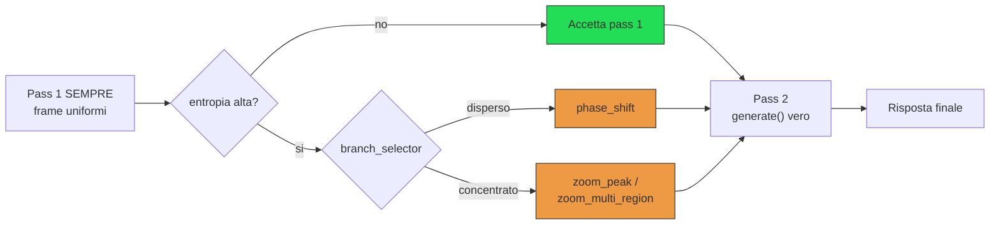
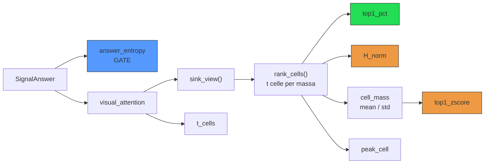
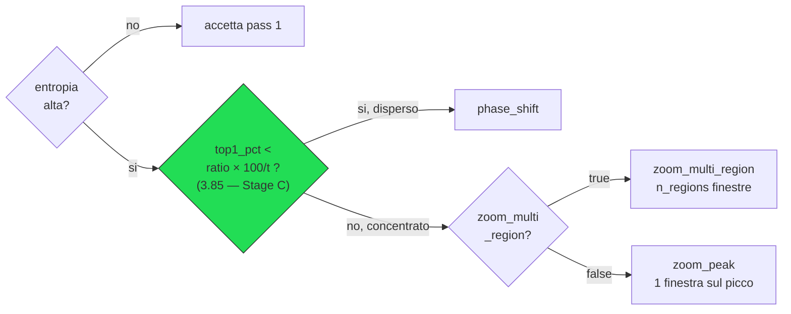

# Segnali di concentrazione e router entropia/attenzione

Ricampionamento adattivo dei frame per VLM su video-MCQ

Video-MME · Qwen2.5-VL-3B · 2026-07-16

---

# 1. Obiettivo

Su un benchmark video-MCQ (Video-MME, Qwen2.5-VL-3B), il campionamento
uniforme dei frame è **"cieco"**: prende sempre lo stesso numero di frame
equispaziati, a prescindere da quanto il modello sia confidente o da dove
stia effettivamente guardando.

- Usare segnali che il modello produce **gratis** durante l'inferenza
  (nessun forward aggiuntivo oltre a quelli già necessari)
- Decidere, sample per sample:
  1. **SE** vale la pena ricampionare (il modello indovina o è già sicuro?)
  2. **COME** ricampionare, se sì (dove guardare invece di ricampionare
     alla cieca?)

---

# 2. Pipeline per ogni sample

I sample "accettati" sono <b>bit-per-bit identici</b> alla baseline
<code>uniform</code> — solo il pass 2 conta per la risposta.

---

# Punti chiave del design

- **Il pass 1 costa sempre** — forward di prefill completo con cattura
  dell'attenzione, indipendentemente dal fatto che poi si ricampioni o
  no. Non è "extra solo se serve".
- **La risposta finale viene SEMPRE da una vera `generate()`** — mai dal
  solo `pred_letter` della softmax ristretta del pass 1.
   → i sample "accettati" restano bit-per-bit identici alla baseline
  `uniform`: l'unico effetto misurabile viene dai sample effettivamente
  ricampionati.
- **Al massimo un ricampionamento** — nessun terzo pass che ri-verifichi
  la decisione.

---

# 3. I segnali

* answer_entropy = gate, indipendente dall'attenzione. 
* top1_pct (vincitore) guarda solo il picco. 
* H_norm
* top1_zscore (entrambi battuti) usano l'intera distribuzione.

---

# 3.1 `answer_entropy` — il segnale di GATE

Entropia di Shannon (in bit) della softmax **ristretta alle sole lettere
candidate** (A/B/C/D...) sui logit dell'ultimo token del prefill:

$$H = -\sum_{i=1}^{n_{\text{opzioni}}} p_i \log_2 p_i$$

$H = 0$ → confidente

$H = \log_2(n_{\text{opzioni}})$ → sta indovinando

Usato oggi come **gate**:

$$\text{can\_resample} = \text{answer\_entropy} > \tau $$

default 0.7

Pilota VNBench (30 video): separazione netta fra risposte corrette e
sbagliate — $r = -0.75$, il segnale più forte fra tutti quelli provati.

---

# 3.2 `top1_pct` — concentrazione dell'attenzione sul frame di picco

In parole semplici: <b>la percentuale di attenzione "pulita" (senza i
token sink) che il modello dedica al SUO frame preferito</b> — quanto si
fissa su un unico istante del video invece di guardarlo tutto.

Sulla mappa di attenzione testo→visivo (già catturata dal pass 1):

1. si azzerano i token **"sink"** (`sink_view`) — altrimenti assorbono la
   maggior parte della massa indipendentemente dal contenuto
2. si aggregano le celle spazio-temporali per massa totale (`rank_cells`)
3. si prende la **percentuale di massa sulla cella (frame) più
   attenzionata** → questo è `top1_pct`

Alto → il modello "si fissa" su un frame preciso (grounding).
Basso/vicino all'uniforme → attenzione dispersa su tutto il video.

**Perché**: correlazione più debole dell'entropia ($r = 0.58$), ma si è
rivelato — dopo un confronto empirico a tre — il **migliore** dei segnali
di concentrazione provati, nonostante sia il più "grezzo".

---

# 3.3 / 3.4 — due tentativi battuti

### `H_norm` — entropia normalizzata

$$H_{\text{norm}} = \frac{H}{\log t}, \quad H = -\sum_{i=1}^{t} p_i \log p_i$$

$0$ = tutta la massa su una cella · $1$ = dispersione perfettamente
uniforme su $t$ celle.

Intuizione: <code>top1_pct</code> guarda solo il picco, ignora la forma
del resto della distribuzione.
 <b>Risultato: separa nella direzione giusta ma più debolmente di
top1_pct.</b>

### `top1_zscore` — outlier per-sample

$$z = \frac{\text{top1\_pct} - \mu}{\sigma}$$

$\mu,\sigma$ = media/dev.std delle masse per-cella dello stesso video —
nessuna calibrazione esterna.

Intuizione: normalizzazione completamente per-sample, alternativa più
"pulita" a una soglia fissa.
 <b>Risultato: ancora più debole di H_norm — il peggiore dei tre.</b>

---

# 4. Le decisioni prese, in ordine

4.1 — Serve un gate E una decisione di ramo

Ricampionare sempre alla cieca funziona (+3.2pt vs uniform) ma un
**oracolo** che sceglie il ramo giusto per sample recupera **98/163**
sample, contro **83/163** del miglior ramo singolo — **+15 di margine
puro dal solo instradamento**.

**4.2 — Le soglie assolute fisse sono morte su Video-MME**

Le soglie $\text{concentration\_threshold} \in \{20, 30, 45\}$ (dal
pilota VNBench) non discriminano più nulla: su Video-MME `top1_pct` non
supera mai ~23%.

---

# 4.3 Tre segnali di concentrazione a confronto

Separazione statistica (Mann-Whitney, $|z|$) fra sample dove "zoom
multi-regione" batte "fase sfasata" e viceversa — 163 sample ricampionati.

| segnale | separazione \|z\| | plateau accuracy /163 |
|---|---:|---:|
| **`top1_pct`** (grezzo) | **2.77** | **88–90** |
| `H_norm` | 2.23 | 85–87 |
| `top1_zscore` | 1.70 | 87 |

Riferimento: sempre-fase-sfasata = 83/163, sempre-zoom = 78/163, oracolo
= 98/163.

Nessuno dei due segnali "più sofisticati" ha battuto il proxy grezzo →
decisione: usare <code>top1_pct</code>.

---

# Separazione Mann-Whitney — cos'è

Test **non parametrico** che confronta due gruppi indipendenti guardando
i **ranghi** dei valori (non i valori grezzi) — non assume distribuzioni
normali.

Utile qui perché <code>top1_pct</code> è fortemente non-normale (poche
celle alte, coda lunga di celle quasi a zero).

Si uniscono i due gruppi, si ordinano tutti i valori e si sommano i
ranghi del gruppo 1 ($R_1$):

$$U = R_1 - \frac{n_1(n_1+1)}{2}$$

Sotto l'ipotesi nulla (nessuna differenza) $U$ ha media $\frac{n_1
n_2}{2}$ e varianza nota → si standardizza in uno z-score:

$$z = \frac{U - \dfrac{n_1 n_2}{2}}{\sqrt{\dfrac{n_1 n_2 (n_1+n_2+1)}{12}}}$$

$|z|$ grande = i due gruppi sono davvero separati, non per caso.

---

# Separazione Mann-Whitney — come l'abbiamo calcolata noi

Sui 163 sample ricampionati da entrambi i rami, **35 sono discordanti**:
**15 pro-`zoom_multi_region`**, **20 pro-`phase_shift`**. Per ciascun
segnale candidato (misurato al pass 1, prima di sapere quale ramo
avrebbe vinto) si confrontano i due gruppi:

| | $n$ | `top1_pct` mediana |
|---|---:|---:|
| pro-`zoom_multi_region` | 15 | **7.60** |
| pro-`phase_shift` | 20 | 4.96 |

$$U = 233, \quad \frac{n_1 n_2}{2} = 150, \quad z = \frac{233 - 150}{\sqrt{15 \cdot 20 \cdot 36 / 12}} = \frac{83}{30} \approx 2.77$$

$p \approx 0.003$ — separazione altamente significativa: campioni più
concentrati (`top1_pct` alto) → vince più spesso
<code>zoom_multi_region</code>.

---

# 4.4 La soglia dev'essere un ratio

`top1_pct` è una percentuale su $t$ celle: sotto attenzione uniforme
("livello di caso") il suo valore atteso è

$$\frac{100}{t}$$

Normalizzando per questo, la soglia si riscala automaticamente fra
`nframes`/dataset diversi:

$$\text{ratio} = \frac{\text{top1\_pct}}{100 / t}$$

$t = 64$ per $\text{nframes} = 128$, **verificato su GPU reale** — non
solo dedotto dal codice: fattore di merge temporale a coppie del modello,
$t = \text{nframes} / 2$.

Soglia scelta: $\text{concentration\_ratio} = 3.85$

equivalente a $\text{top1\_pct} \approx 6.02$ a $t = 64$, dentro il
plateau 88–90/163

---

# 5. Cosa fa il codice OGGI

`branch_selector` — tre modalità, selezionabili senza toccare codice,
**additive**:

| `branch_selector` | condizione "disperso" | stato |
|---|---|---|
| `"concentration"` (default) | $\text{top1\_pct} < \text{concentration\_threshold}$ | storico, **soglia inerte** |
| `"concentration_ratio"` | $\text{top1\_pct} < \text{concentration\_ratio} \cdot \frac{100}{t}$ | **Stage C, in validazione** |
| `"entropy"` | $H_{\text{norm}} > \text{attention\_entropy\_threshold}$ | provato, **battuto** |

---

# La strada scelta: `concentration_ratio`

---

# 5.1 `zoom_peak` — finestra unica sul picco

1. `peak_cell` = indice della cella a massa più alta (`ranked_cells[0]`)
2. Posizione temporale frazionaria:
   $$\text{frac} = \frac{\text{peak\_cell} + 0.5}{t}$$
3. Mappata sulla finestra reale del pass 1 ($w_0$/$w_1$):
   $$\text{peak\_time} = w_0 + \text{frac} \cdot (w_1 - w_0)$$
4. Finestra stretta di semi-larghezza
   $$\frac{\text{window\_frac} \cdot (w_1 - w_0)}{2}$$
   (default $\text{window\_frac}=0.3$ → 30%) centrata su
   $\text{peak\_time}$, clampata a $[0, \text{duration}]$
5. Ricampiona `nframes` **uniformi** dentro questa finestra ristretta

Una sola regione, nessuna gestione di sovrapposizioni o budget-splitting.

---

# 5.1 `zoom_multi_region` — fino a `n_regions` finestre disgiunte

Stesso principio di `zoom_peak`, generalizzato a più massimi locali:

1. **`_select_region_cells`** — `"topk"`: prime `n_regions` celle.
   `"adaptive"` (default): mediana + `region_mad_k`·MAD, escludendo il
   picco globale (evita l'auto-mascheramento)
2. **`_multi_region_spans`** — centri più vicini di
   $\text{region\_merge\_gap\_frac} \cdot (w_1-w_0)$ fusi insieme; ogni
   centro → finestra di semi-larghezza fissa
   $\text{region\_window\_frac} \cdot (w_1-w_0)$ (default 10%); merge
   finale per garantire finestre disgiunte
3. **`_allocate_region_budget`** — divide `nframes` fra le regioni
   (`"equal"` o `"proportional"` alla massa), somma sempre $\le$ `nframes`
4. **`_build_multi_region_media`** — estrae i frame, calcola
   $\text{sample\_fps} = \text{frame totali} / \text{durata regioni usate}$
   e impacchetta come `VideoFrames` (il modello vede i frame come
   uniformemente spaziati, i "buchi" fra regioni spariscono)

---

# 6. Risultati sperimentali chiave

Video-MME, subset 250, seed 42

| strategia | accuracy | note |
|---|---:|---|
| uniform (controllo) | 62.8% | baseline |
| fase sfasata sempre | 66.0% | +3.2pt |
| zoom multi-regione forzato sempre | 64.0% | recupera 13 sample UNICI |
| oracolo (ramo giusto per sample) | ~68.8% | limite superiore teorico |
| router `top1_pct` (`ratio=3.85`) | **atteso ~68.8%, da verificare** | **Stage C, run in corso** |

---
layout: center
class: text-center
---

# Domande?

docs/sintesi_segnali_router_concentrazione.md — cronologia completa in
docs/piano_zoom_multiregione_disgiunto.md

