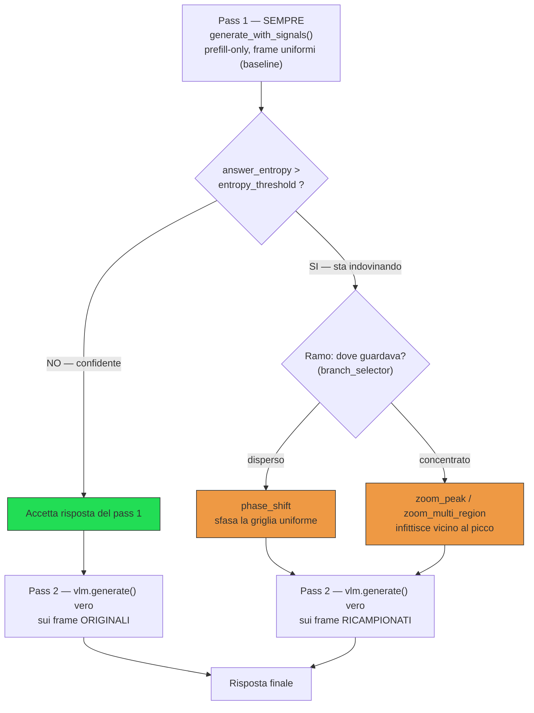
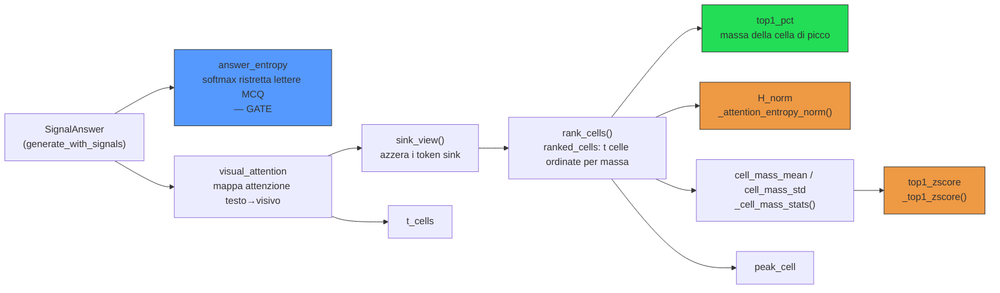
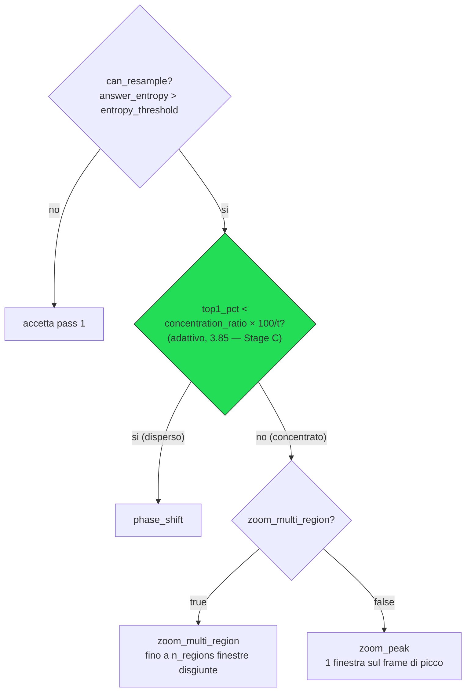

# Sintesi — segnali di concentrazione e router entropia/attenzione

> Documento di sintesi (2026-07-16), preparato per presentare lo stato del
> lavoro. Raccoglie in un unico posto: cosa stiamo cercando di fare, quali
> segnali vengono calcolati e loggati nel codice, come e perché sono stati
> scelti, quali esperimenti li hanno validati/respinti. Per il dettaglio
> passo-passo delle analisi vedi `docs/piano_zoom_multiregione_disgiunto.md`
> (cronologia completa) — questo file ne è il riassunto ad alto livello.

## 1. Obiettivo

Su un benchmark video-MCQ (Video-MME, Qwen2.5-VL-3B), il campionamento
uniforme dei frame è "cieco": prende sempre lo stesso numero di frame
equispaziati, a prescindere da quanto il modello sia confidente o da dove
stia effettivamente guardando. L'idea centrale: usare segnali che il
modello produce **gratis** durante l'inferenza (nessun forward aggiuntivo
oltre a quelli già necessari) per decidere, sample per sample:

1. **SE** vale la pena ricampionare (il modello sta indovinando o è già
   sicuro?).
2. **COME** ricampionare, se sì (dove guardare invece di ricampionare alla
   cieca?).

Questo è implementato in `strategies/entropy_attention_resample.py`
(`EntropyAttentionResampleStrategy`, preset `strategy=entropy_attention_
resample` in `conf/config.yaml`).

## 2. Come funziona il meccanismo (pipeline per ogni sample)

Nota: i sample che finiscono in "Accetta risposta del pass 1" (nessun
ricampionamento) sono **bit-per-bit identici** alla baseline `uniform` —
solo il pass 2 conta per la risposta, il pass 1 serve solo a decidere.

Punti chiave del design:

- **Il pass 1 costa sempre** (è un forward di prefill completo con
  cattura dell'attenzione), **indipendentemente** dal fatto che poi si
  ricampioni o no — non è "extra solo se serve".
- **La risposta finale viene SEMPRE da una vera `generate()`** — mai dal
  solo `pred_letter` della softmax ristretta del pass 1. Questo garantisce
  che i sample "accettati" restino bit-per-bit identici alla baseline
  `uniform`: l'unico effetto misurabile viene dai sample effettivamente
  ricampionati.
- **Al massimo un ricampionamento** — nessun terzo pass che ri-verifichi
  la decisione.

## 3. I segnali: cosa calcoliamo, dove, perché

Tutti calcolati in `strategies/entropy_attention_resample.py::answer()`
(righe 414-440), a partire dall'oggetto `SignalAnswer` restituito da
`vlm.generate_with_signals(...)` (`models/signals.py`, implementato da
`Qwen25VLAttention.generate_with_signals` in `models/qwen_attn.py`, che
avvolge `full_visual_attention` — stesso forward già necessario per la
cattura, zero costo aggiuntivo).

`answer_entropy` (blu) è il segnale di gate, calcolato indipendentemente
dall'attenzione. Tutto il resto discende dalla stessa `ranked_cells`:
`top1_pct` (verde, il vincitore) guarda solo il picco; `H_norm` e
`top1_zscore` (arancio, entrambi battuti) provano a usare l'intera
distribuzione delle masse invece del solo picco.

### 3.1 `answer_entropy` — il segnale di GATE

**Cos'è**: entropia di Shannon (in bit) della distribuzione softmax
**ristretta alle sole lettere candidate** (A/B/C/D...) sui logit
dell'ultimo token del prefill — non la softmax sull'intero vocabolario:

$$H = -\sum_{i=1}^{n_{\text{opzioni}}} p_i \log_2 p_i$$

$H = 0$ → il modello è certissimo di una lettera. $H = \log_2(n_{\text{opzioni}})$ →
distribuzione piatta, sta indovinando.

**Perché**: prima ipotesi testata (pilota VNBench, 30 video, `docs/
entropia_confidenza_mcq.md`) — correlazione con la correttezza $r = -0.75$,
il segnale più forte fra tutti quelli provati. Usato oggi come **gate**:

$$\text{can\_resample} = \text{answer\_entropy} > \text{entropy\_threshold}$$

(default $0.7$, non validato per Video-MME nello specifico — soglia
ereditata dal pilota VNBench, dominio/nframes diversi).

### 3.2 `top1_pct` — concentrazione dell'attenzione (il segnale vincente)

**Cos'è**: sulla mappa di attenzione testo→visivo (già catturata dal
pass 1), si azzerano prima i token "sink" (`sink_view`, altrimenti
assorbono la maggior parte della massa indipendentemente dal contenuto —
`docs/qwen25vl_entity_attention.md`), si aggregano le celle spazio-
temporali per massa totale (`rank_cells`), e si prende la **percentuale
di massa (post-filtro-sink) sulla cella più attenzionata**. Alto →
il modello "si fissa" su un frame preciso (grounding). Basso/vicino
all'uniforme → attenzione dispersa su tutto il video.

**Perché**: seconda ipotesi (stesso pilota VNBench) — correlazione più
debole dell'entropia ($r = 0.58$) ma stesso verso atteso. Usato per
decidere **il ramo** (vedi §4) — e si è rivelato, dopo un confronto
empirico a tre (§4.3), il **migliore** dei segnali di concentrazione
provati, nonostante sia il più "grezzo".

### 3.3 `attention_entropy_norm` (H_norm) — tentativo di segnale più ricco

**Cos'è**: entropia di Shannon **normalizzata** sulle masse di **tutte**
le $t$ celle (non solo il picco):

$$H_{\text{norm}} = \frac{H}{\log t}, \qquad H = -\sum_{i=1}^{t} p_i \log p_i$$

$H_{\text{norm}} = 0$ → tutta la massa su una cella, $H_{\text{norm}} = 1$
→ dispersione perfettamente uniforme su $t$ celle. Funzione
`_attention_entropy_norm` (righe 110-131).

**Perché provato**: `top1_pct` guarda solo il picco, ignora la forma di
tutto il resto della distribuzione — l'intuizione era che l'entropia
sull'intera distribuzione fosse un segnale di concentrazione più completo
e quindi migliore per instradare. **Risultato (§4.3): l'ipotesi non ha
retto** — separa nella direzione giusta ma più debolmente di `top1_pct`.

### 3.4 `top1_zscore` — tentativo di segnale adattivo per-sample

**Cos'è**: quanto la cella di picco è un **outlier** rispetto alla media/
dev.std delle masse di **tutte** le celle dello stesso video:

$$z = \frac{\text{top1\_pct} - \mu}{\sigma}$$

calcolato interamente dai dati di quel singolo video ($\mu$, $\sigma$ =
media e dev.std delle masse per-cella; nessuna calibrazione esterna,
nessun bisogno di conoscere $t$). Funzioni `_cell_mass_stats`/
`_top1_zscore` (righe 134-167).

**Perché provato**: tentativo di normalizzazione **completamente
per-sample**, l'alternativa più "pulita" concettualmente a una soglia
fissa. **Risultato (§4.3): ancora più debole di `H_norm`** — il segnale
peggiore dei tre.

### 3.5 Segnali di supporto (loggati ma non usati per decidere)

- `peak_cell` — indice della cella di picco (posizione temporale).
- `t_cells` — numero di celle temporali del pass 1 (dipende da `nframes`
  e dal fattore di merge temporale del modello, verificato = 64 per
  `nframes=128`).
- `cell_mass_mean`/`cell_mass_std` — media/dev.std delle masse per-cella,
  ingredienti grezzi dietro `top1_zscore`, loggati anche da soli per poter
  ricalcolare offline normalizzazioni alternative senza dover ricatturare.
- `resample_kind`, `n_regions_used`, `region_spans` — quale ramo è stato
  preso e con quali finestre temporali (diagnostica win/loss a posteriori).

Tutti i segnali (tranne quelli di gate) sono calcolati e loggati **SEMPRE**
quando `signal.visual_attention is not None` — anche nei sample "accettati"
(non ricampionati) — per poter analizzare a posteriori come si distribuiscono
rispetto alla decisione, non solo per i sample effettivamente ricampionati.

## 4. Le decisioni prese, in ordine, con i numeri

### 4.1 Serve un gate E una decisione di ramo, non solo un gate

Ricampionare *sempre* alla cieca (fase sfasata) quando l'entropia è alta
funziona (+3.2 punti accuracy vs uniform, §4.2) ma lascia sul tavolo
segnale: un'analisi win/loss (`docs/piano_zoom_multiregione_disgiunto.md`,
"Verifica pre-implementazione") ha mostrato che un **oracolo** che sceglie
per ogni sample il ramo giusto (fase sfasata vs zoom sul picco) recupera
**98/163** sample ricampionati, contro **83/163** del miglior ramo singolo
preso da solo — **+15 di margine puro dal solo instradamento**.

### 4.2 Le soglie assolute fisse sono morte su Video-MME

Le soglie originali ($\text{concentration\_threshold} \in \{20, 30, 45\}$) venivano
dal pilota VNBench (dominio/nframes diversi). Su Video-MME (`nframes=128`)
`top1_pct` non supera mai ~23% — **nessuna** di quelle soglie discrimina
mai nulla: uno sweep 4×3 di soglie ha dato risultati piatti (tutti i
sample ricampionati finivano sempre nello stesso ramo, a prescindere dalla
soglia). Da qui la necessità di una soglia **adattiva**.

### 4.3 Tre segnali di concentrazione a confronto — `top1_pct` vince

Per capire quale segnale usare per la soglia adattiva, si sono confrontati
`top1_pct`, `H_norm` e `top1_zscore` sullo stesso test: separazione
statistica (Mann-Whitney) fra i sample dove "zoom multi-regione" batte
"fase sfasata" e viceversa, più uno sweep di soglia sull'intero
sottoinsieme ricampionato (163 sample, 3 run wandb distinti uniti per
`example.id`: `o54z2xsd`/`ujdksy60` fase sfasata, `z4qx9hnb` zoom forzato,
`ktvjcyye` controllo uniforme).

| segnale | separazione (\|z\| Mann-Whitney) | plateau accuracy /163 |
|---|---:|---:|
| **`top1_pct`** (grezzo) | **2.77** | **88–90** |
| `attention_entropy_norm` (H_norm) | 2.23 | 85–87 |
| `top1_zscore` | 1.70 | 87 |

Riferimento: sempre-fase-sfasata = 83/163, sempre-zoom = 78/163, oracolo =
98/163. **Nessuno dei due segnali "più sofisticati" ha battuto il proxy
grezzo** — decisione: usare `top1_pct`.

### 4.4 La soglia dev'essere un ratio, non un valore assoluto

Anche con `top1_pct` come segnale vincente, una soglia assoluta (es. 6.0,
il valore ottimale trovato per `nframes=128`) avrebbe lo stesso problema
di trasferibilità di quelle originali: cambiando `nframes`/dataset la
scala di `top1_pct` si sposta. `top1_pct` è una percentuale su $t$ celle,
quindi il suo valore atteso sotto attenzione uniforme ("livello di caso")
è $100/t$. Normalizzando per questo,

$$\text{ratio} = \frac{\text{top1\_pct}}{100/t}$$

la soglia si riscala automaticamente.

$t$ ($=64$ per $\text{nframes}=128$) è stato **verificato su GPU reale**
(non solo dedotto dal codice): una cattura di test ha confermato $t=64$
esatto, dal fattore di merge temporale a coppie del modello
($t = \text{nframes}/2$).

**Soglia scelta: $\text{concentration\_ratio} = 3.85$** (equivalente a
$\text{top1\_pct} \approx 6.02$ a $t=64$, dentro il plateau 88-90/163 di
§4.3).

## 5. Cosa fa il codice OGGI (`branch_selector`, `conf/config.yaml`)

Tre modalità, selezionabili senza toccare codice (`strategy.branch_
selector=...`), **additive**: cambiare selettore non altera il
comportamento degli altri (compatibilità bit-per-bit con gli sweep
storici):

| `branch_selector` | condizione "disperso" (→ fase sfasata) | stato |
|---|---|---|
| `"concentration"` (default) | $\text{top1\_pct} < \text{concentration\_threshold}$ (assoluto, es. 30) | storico, **soglia inerte** su Video-MME |
| `"concentration_ratio"` | $\text{top1\_pct} < \text{concentration\_ratio} \cdot \frac{100}{t}$ | **Stage C, in validazione ora** |
| `"entropy"` | $H_{\text{norm}} > \text{attention\_entropy\_threshold}$ | provato, **battuto da `top1_pct`** |

### 5.1 Come sono implementati `zoom_peak` e `zoom_multi_region`

**`zoom_peak`** (`strategies/entropy_attention_resample.py`, righe 502-512)
— finestra unica centrata sul frame di picco:

1. `peak_cell` è l'indice della cella a massa più alta (`ranked_cells[0]`,
   già calcolato prima del branch).
2. Converte l'indice di cella in posizione temporale **frazionaria**:

   $$\text{frac} = \frac{\text{peak\_cell} + 0.5}{t}$$

   (il $+0.5$ centra sulla cella, non sul bordo).
3. Mappa la frazione sulla finestra reale del pass 1 ($w_0$/$w_1$):

   $$\text{peak\_time} = w_0 + \text{frac} \cdot (w_1 - w_0)$$

4. Costruisce una finestra stretta di semi-larghezza

   $$\frac{\text{window\_frac} \cdot (w_1 - w_0)}{2}$$

   (default $\text{window\_frac}=0.3$ → 30% dell'intervallo originale)
   centrata su $\text{peak\_time}$, clampata a $[0, \text{duration}]$.
5. `_build_media(video_path, None, new_start, new_end, budget)` ricampiona
   `nframes` **uniformi** dentro questa finestra ristretta — stesso
   meccanismo della baseline `uniform`, solo su un intervallo più corto
   (→ più densità temporale sulla stessa zona).

Una sola regione, nessuna gestione di sovrapposizioni o budget-splitting.

**`zoom_multi_region`** (righe 170-360, orchestrato a 487-501) — stesso
principio ma fino a `n_regions` finestre **disgiunte**, ciascuna centrata
su una cella a massa alta, con budget frame ripartito fra loro. Quattro
fasi:

1. **`_select_region_cells`** (righe 170-193) — quali celle-picco usare.
   `"topk"`: le prime `n_regions` di `ranked_cells` (già ordinate per
   massa decrescente). `"adaptive"` (default): mediana + `region_mad_k`·MAD
   calcolate **escludendo il picco globale** (altrimenti l'outlier che si
   vuole selezionare gonfierebbe la propria stessa soglia —
   auto-mascheramento), poi cap a `n_regions`.
2. **`_multi_region_spans`** (righe 196-254) — da celle a finestre
   temporali disgiunte. Ogni cella selezionata → centro temporale (stessa
   formula frazionaria di `zoom_peak`); centri più vicini di

   $$\text{region\_merge\_gap\_frac} \cdot (w_1 - w_0)$$

   vengono fusi in un solo centro (media pesata dalla massa); ogni centro
   (fuso) diventa una finestra di semi-larghezza fissa

   $$\text{region\_window\_frac} \cdot (w_1 - w_0)$$

   (default 10%, quindi più stretta di `zoom_peak`); passata finale di
   merge per garantire che, anche dopo l'allargamento a larghezza fissa,
   le finestre restino disgiunte.
3. **`_allocate_region_budget`** (righe 257-284) — come dividere `nframes`
   fra le regioni trovate. `"equal"`: parti uguali. `"proportional"`
   (default): pesato per la massa d'attenzione di ciascuna regione.
   Vincolo: la somma non supera mai `nframes` (limite VRAM); se
   `nframes < numero di regioni`, tiene solo le regioni a peso più alto
   con 1 frame ciascuna.
4. **`_build_multi_region_media`** (righe 287-360) — estrazione frame
   reale. Per ogni regione con budget > 0 estrae frame equispaziati
   (`linspace`) dentro la finestra (`n=1` → frame centrale, non il
   bordo); deduplica/ordina tutti gli indici sull'unione delle regioni;
   calcola

   $$\text{sample\_fps} = \frac{\text{frame totali}}{\text{durata totale regioni usate}}$$

   (non dell'intera finestra pass-1) — la densità effettiva vista dentro
   le regioni, ignorando i "buchi" fra una regione e l'altra; impacchetta
   come `VideoFrames` con quel `sample_fps`
   iniettato, così il modello li vede come uniformemente spaziati su un
   video continuo (semplificazione accettata: i buchi fra regioni
   "spariscono" dalla codifica posizionale). La directory temporanea
   viene ripulita in un `finally` dopo la `generate()` finale, anche in
   caso di eccezione durante l'estrazione.

In sintesi: `zoom_peak` è "una finestra sul massimo"; `zoom_multi_region`
generalizza la stessa idea a più massimi locali, con la complicazione di
dover fondere finestre vicine/sovrapposte e spartire un budget frame
fisso fra loro in proporzione alla massa.

## 6. Risultati sperimentali chiave (Video-MME, subset 250, seed 42)

| strategia | accuracy | note |
|---|---:|---|
| uniform (controllo) | 62.8% | baseline |
| fase sfasata sempre (gate su entropia, nessun ramo) | 66.0% | +3.2pt |
| zoom multi-regione forzato sempre | 64.0% | peggio della fase sfasata da solo, ma recupera 13 sample UNICI che l'altro non prende |
| oracolo (ramo giusto per sample) | ~68.8% (98/163 sui ricampionati) | limite superiore teorico del routing |
| router `top1_pct` a soglia adattiva (`ratio=3.85`) | **atteso ~68.8%, da verificare** | **Stage C, run in corso** |

## 7. Esperimento in corso (Stage C)

Run `qwen2_5_vl_3b_attn-stageC-router-concentration_ratio`:
`branch_selector=concentration_ratio`, `zoom_multi_region=true`, stesso
subset/seed 250. Obiettivo: verificare se il guadagno teorico
dell'oracolo (§4.1) si traduce in un guadagno reale quando il routing è
deciso da un segnale misurato (non dall'oracolo) — cioè se `top1_pct`
generalizza fuori dal sottoinsieme usato per calibrare la soglia in §4.3.
Se il numero regge (~68-69%), prossimo passo: run sull'intero dataset
(2700 sample). Se non regge, il segnale era "fortunato" sul campione di
calibrazione — da rivedere prima di scalare.
